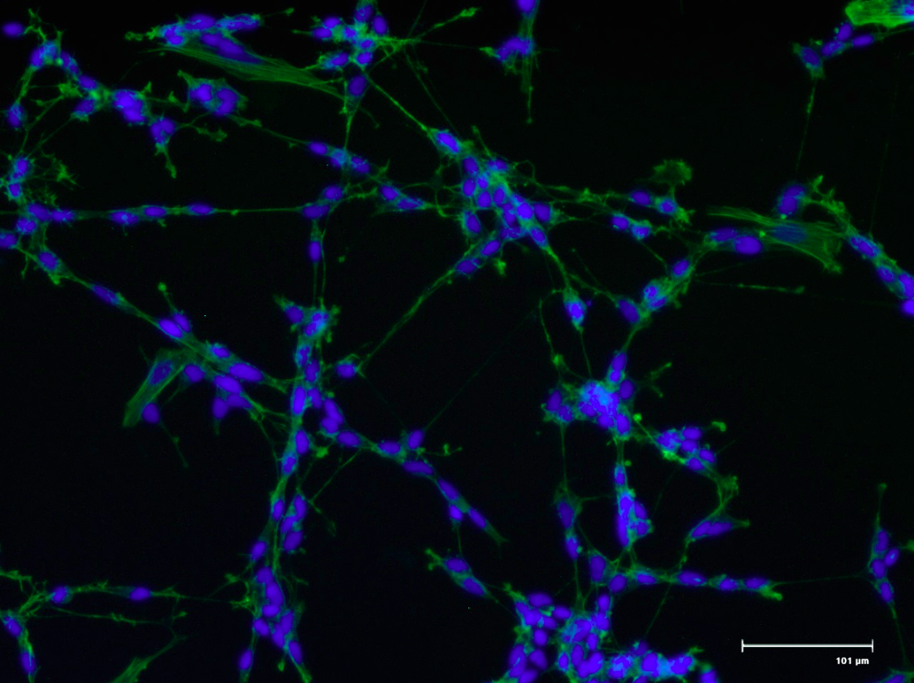
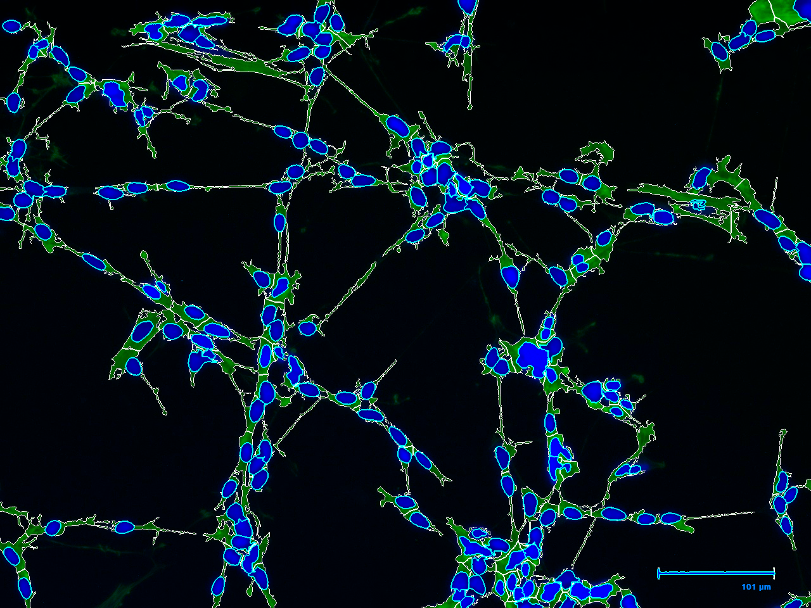
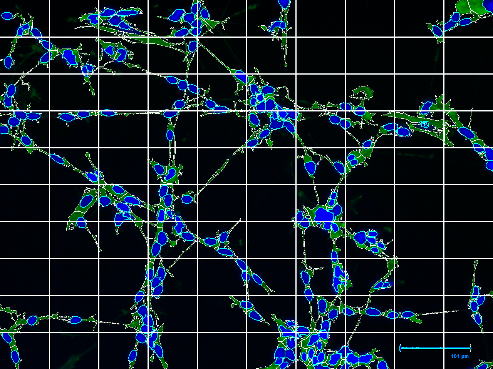
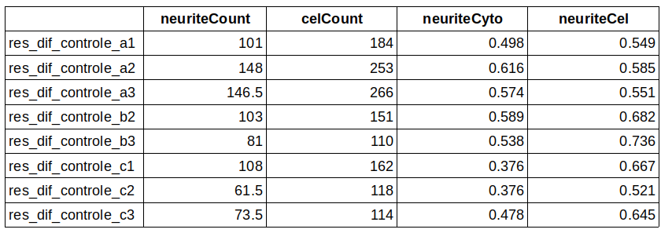

# Overview

For better understanding of neurodegenerative diseases is very important the study of neurons and its operation. Neurites (dendrites and axons) are critical for communication between neurons which brings the importance of analysing neurites. The characterization of neurite outgrowth and density of neurites for instance is key for the understanding of neuropathological diseases and screening for neurotoxicity. **neuriteScan** is a tool for quantifying neurite density in  fluorescence microscopy 2D images. The package algorithm contains functions implemented in R and Python programming languages utilizing the `reticulate` package [@Ushey2020] to achieve that combination. **neuriteScan** analysis can be done using a single image to be analised or a large amount of images. For high throughput analyzis the `batchScanning` function is the best way to go. Quantification of neurite density is calculated through the `neuritescan` function which returns to the user a dataframe containing six measures: total neurite density, neurite density per number of cells, neurite density per cytoplasm area and number of cells.


# Quick Start

## Load images

This Vignette uses fluorescence microscopy 2D images avaliable in **neuriteScan** package:

```{r, eval=FALSE}
library(neuriteScan)
library(EBImage)
library(reticulate)
image <- system.file("images", "example.jpg", package = "neuriteScan")
image <- readImage(image)

```

The image can be read using the EBImage function `readImage` or if the user has two images in separated channels the merge between them can be achieved using the `readRgbChannels` function from the **neuriteScan** package. 

More information about the `readRgbChannels` function can be accessed using the R base function `help`. 

```{r, eval=FALSE, warning=FALSE}
help(readRgbChannels)
```

## Image PreProcessing

The next step of the **neuriteScan** package is to perform image preprocessing to improve image quality, removing noise and some artefacts from the immunofluorescence staining. Preprocessing algorithm contains CLAHE method to improve contrast and Non-Local Means filter (NLM) to be aplied on image to remove the noise.

```{r, eval=FALSE}
improved_image <- preProcessing(image)
```


## Image Segmentation

With the improved image, the next step of the **neuriteScan** package is the segmentation. The segmentation is a very important step to achieve the neurite density and the `channelSegmentation` function is responsible for this step.

The input object of the `channelSegmentation` function is the improved image obtained in the previous section, or the original image if the user of **neuriteScan** does not want to apply the preprocessing step.

There are two major parameters of `channelSegmentation` : `bandwidth` and `fpicks`. The `bandwidth` parameter defines the measure of the band to be considered during the segmentation. Higher the `bandwidth` higher the area of the object that will be identificated. The `fpicks` parameter defines the extensions of the cytoplasm to be considered during the segmentation. Higher the `fpicks` lower the extensions that will be identificated.

```{r, eval=FALSE, results='hide'}
segImage <- channelSegmentation(improved_image, bandwidth = 10, fpicks = 0.01)
```


`channelSegmentation` returns a list containing, besides the final segmented colored image, the binary masks for the nuclei and cytoplasm, the grayscale images for nuclei and cytoplasm and the input image for comparisions. The segmented image (**Figure1**) it will be used as input for the next step of the **neuriteScan** package, the neurite density quantification.

## Neurite density quantification

Once the segmented image is obtained, the `neuriteScan` function quantifies the neurite density of the image. The main parameter of the `neuriteScan` is lengthLimit. The lengthLimit parameter defines the extensions identified to be considered as neurite. The extensions that will be considered are below the value defined for the parameter.

```{r, eval=FALSE}
results <- neuriteScan(segImage, gridscan = 10, lengthLimit = 30)
```

```{r, eval=TRUE, include=FALSE}

```



# High throughput analysis

**neuriteScan** differential is definitely the function `batchScanning`. This function supports the input of many images and quantifies neurite density for every one of them. Besides the final results, `batchScanning` returns a folder with all the images segmented.

`batchScanning` parameters include the major parameters from the `channelSegmentation` and `neuritescan` functions so the user can customize the analysis that suits your research.

```{r, eval=FALSE}
batchScanning(path = "figures/batchimages/", fflag = "controle", resdir = "resdir", bandwidth = 10, fpicks = 0.01, lengthLimit = 30, gridscan = 10)
```


# Case Study


# Session information
```{r label='Session information', eval=TRUE, echo=FALSE}
sessionInfo()
```

# References

